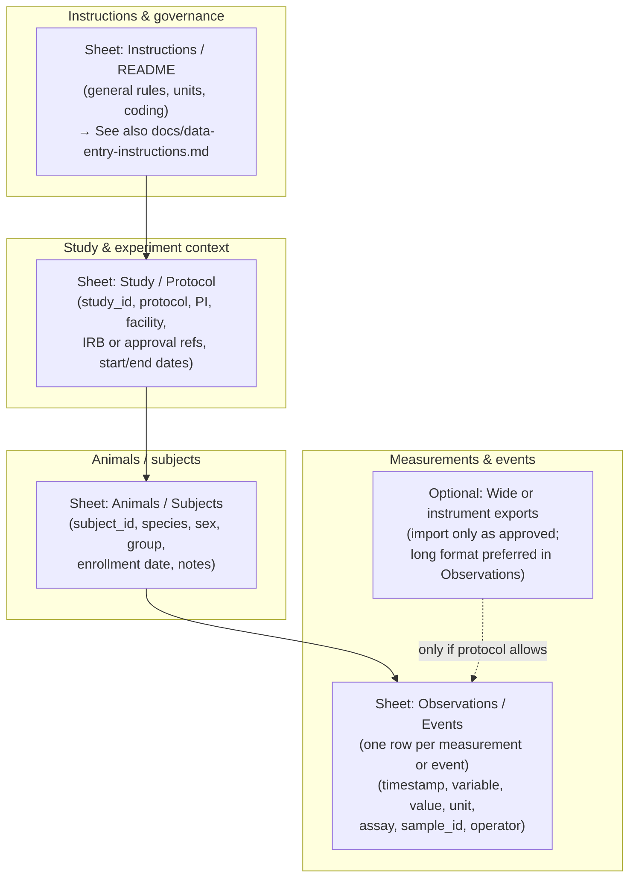
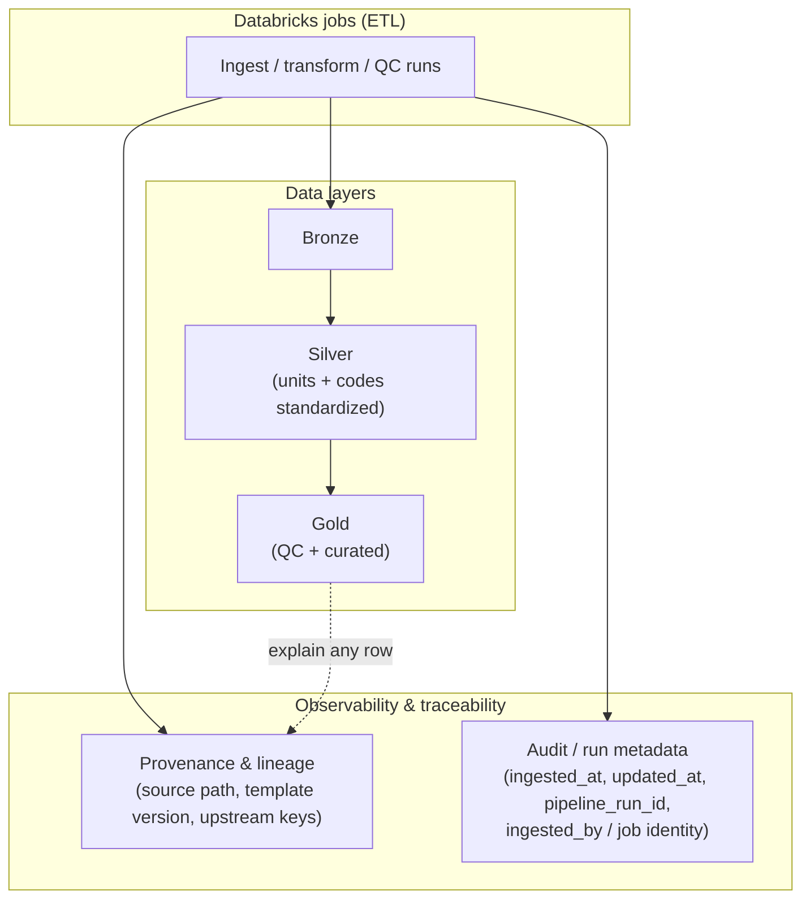

# McFadden Lab research data pipeline

**Maintained by:** Bovi-analytics lab, in support of **Joe McFadden’s lab** (Cornell).

This repository explains how animal-experiment data are collected in a **standard template**, stored in the **cloud**, and processed in a **repeatable pipeline** so data can be checked for quality, transformed (ETL), and promoted to an **analysis-ready “gold” layer** for long-term use.

---

## What this system is for

| Goal | What it means in practice |
|------|---------------------------|
| **Quality** | Data are validated and cleaned before they are trusted for analysis. |
| **Storage** | Authoritative copies live in **Azure Blob Storage** for durable retention. |
| **Streamlining** | **Microsoft Teams** + **Excel for the web** capture data in one place; **Azure Databricks** runs ETL and layering. |
| **Traceability** | Each load records **provenance** and **audit-style metadata** (source, time, job/run id) so results are explainable. |
| **Consistency** | **Units and coding** are harmonized in Silver/Gold against a shared data dictionary. |

The canonical data-entry artifact for students is **`Template workbook.xlsx`** in this repo (the same file is used in Teams; keep them aligned).

---

## Who does what

| Role | Responsibility |
|------|----------------|
| **Students (experiments)** | Enter **all** study data they collect into the template workbook via the Teams workflow. Request new columns/variables if something is missing. |
| **Data entry / data steward** | Read **[General instructions for data entry](docs/data-entry-instructions.md)**; help keep naming consistent; coordinate template updates. |
| **Bovi-analytics / pipeline owners** | Own Azure storage, Databricks jobs, quality rules, and the **gold** layer. |

---

## Student workflow (Teams + Excel online)

1. Open **Microsoft Teams** and go to the **McFadden Lab Research Data Management** team.
2. Open the **Data storage** channel (this is where the lab’s data-entry workbook and links live).
3. Open the **Template workbook** in **Excel for the web** (or the file shared there).
4. Enter data **as you collect it**; the file **saves automatically**. You can **edit** rows anytime; changes save automatically.
5. If you need a **new variable** (column) that is not in the template, **request it** (see [docs/roles-and-requests.md](docs/roles-and-requests.md)) instead of inventing ad-hoc columns without approval.

**Before you type:** read **[General instructions for data entry](docs/data-entry-instructions.md)** so IDs, dates, and units stay consistent.

---

## Template workbook structure (logical model)

The workbook is the **single front door** for tabular experiment data. The exact sheet names and columns follow **`Template workbook.xlsx`**; the diagram below shows the **intended relationships** between typical sheets (your file may use slightly different labels—always follow the live template).

**How to read this diagram**

- **Instructions** sheet: stable rules everyone follows.
- **Study** sheet: one row per study or protocol block (links everything else).
- **Animals** sheet: one row per animal/subject; keys tie to observations.
- **Observations** sheet: the **fact table**—time-stamped measurements and events; this is what the pipeline usually ingests row-by-row.

If your actual workbook merges some of these into fewer sheets, keep the **same logical keys** (`study_id`, `subject_id`, timestamps) so the pipeline can join tables.

---

## End-to-end pipeline: Teams → Azure → Databricks → Gold

```mermaid
flowchart LR
  subgraph teams["Microsoft Teams"]
    T["McFadden Lab Research Data Management team"]
    C["Data storage channel\n(workbook link & guidance)"]
    T --> C
  end

  subgraph capture["Capture"]
    X["Excel for the web\n(Template workbook)\nautosave / edit anytime"]
  end

  subgraph azure["Azure"]
    B["Azure Blob Storage\nauthoritative file / snapshot store\n(durable retention)"]
    DB["Azure Databricks\ningest • ETL • quality checks"]
  end

  subgraph medallion["Medallion-style layers"]
    Br["Bronze / raw\n(as landed from storage)"]
    Si["Silver / cleansed\n(typed, standardized,\ndeduplicated)"]
    Go["Gold / curated\npasses all QC;\nanalysis-ready & documented"]
  end

  C --> X
  X -->|"sync / export / pipeline pick-up\n(as configured by pipeline owners)"| B
  B --> DB
  DB --> Br --> Si --> Go
  Si -.->|"quarantine / fix loop"| Br
```

**How to read this diagram**

- **Teams** is where people **find** the workbook and **operational** guidance (channel: **Data storage**).
- **Excel for the web** provides **collaborative editing** with **automatic saving**.
- **Blob Storage** holds the **durable** copy (or exports) that downstream systems trust.
- **Databricks** runs **ingestion, ETL, and quality checks**; outputs are organized in layers.
- **Gold** is the **qualified** dataset: it has passed checks and is suitable for **analysis and long-term reference**.

Exact connectors (e.g., SharePoint → Blob, scheduled export, or notebook-driven copy) are **owned and documented by Bovi-analytics** in Azure; this repo describes the **intended** flow for the lab.

---

## Provenance, audit metadata, and units (inside the pipeline)

When data are **ingested** or **updated** in the lakehouse, the pipeline should capture **who / where / when / which version** style information. People use several names for this—often together:

| You might say… | What it usually means |
|----------------|------------------------|
| **Data provenance** | **Where data came from** and how it was produced (source file, system, study). |
| **Data lineage** | The **path** through Bronze → Silver → Gold (and which job or notebook transformed it). |
| **Audit trail** | **Who** triggered **what** **when** (loads, publishes, approvals)—important for accountability. |
| **Ingestion metadata** | Technical fields per run: **job id**, **pipeline run id**, **timestamp**, **source URI**, **schema version**, etc. |

**Units and coding:** the **Silver** and **Gold** steps normalize **units** (e.g., to a canonical kg vs. lb) and **codes** (sex, treatment) so downstream analytics and APIs see **one consistent meaning**.

**More detail:** [docs/lineage-metadata-and-units.md](docs/lineage-metadata-and-units.md).

---

## Querying cleaned data (API, R, Python)

After data reach **Gold** (and optionally approved **Silver** views), the lab will expose **read-only access** for analysis:

| Access | Typical use |
|--------|-------------|
| **REST / SQL API** (behind auth) | Dashboards, scripts, and approved third-party tools. |
| **Python notebooks** (Databricks or local) | `pyspark`, SQL cells, or HTTP client to the same API. |
| **R** | `httr2` / `DBI` (or vendor connector) against **parameterized** endpoints or **curated views**—no raw Blob access for casual users. |

Exact endpoints, tokens, and RBAC rules are **owned by Bovi-analytics** and Cornell IT. The principle is: **query the curated layer**, not the raw Excel file, for reproducible science.

---

## Future: analytics portal (dashboard + chatbot + sign-in)

The long-term goal is a **web portal** where authenticated users can **run queries**, **build charts**, and **ask an assistant** questions about the data—**combined in one place** with a **login** (e.g., Cornell SSO).

- **Wireframe (Markdown + diagrams):** [docs/dashboard-mockup.md](docs/dashboard-mockup.md)  
- **Static HTML preview (open in a browser):** [docs/dashboard-mockup.html](docs/dashboard-mockup.html)

---

## Repository layout

| Path | Purpose |
|------|---------|
| `Template workbook.xlsx` | Canonical Excel template for data entry (keep in sync with the file in Teams). |
| `docs/data-entry-instructions.md` | General instructions for anyone entering data. |
| `docs/roles-and-requests.md` | How to request new variables and who approves. |
| `docs/lineage-metadata-and-units.md` | Provenance, audit metadata, and unit harmonization. |
| `docs/dashboard-mockup.md` | Portal wireframe: query + viz + chatbot + sign-in. |
| `docs/dashboard-mockup.html` | Same idea as a simple static page (not connected to real data). |
| `LICENSE` | License for materials in this repository. |

---

## Contributing and template changes

- Prefer **issues or pull requests** in this repo for **documentation** and **proposed template changes** (if your team uses Git that way), or follow the lab’s internal process described in **roles-and-requests**.
- When **`Template workbook.xlsx`** changes, update the **Teams** copy and **this repo** together so students always see one source of truth.

---

## Disclaimer

Pipeline mechanics (schedules, service principals, exact paths in Blob, and Databricks notebooks) depend on your Azure subscription. This repository is a **lab-facing handbook**; operational runbooks may live separately in Bovi-analytics’ internal documentation.
