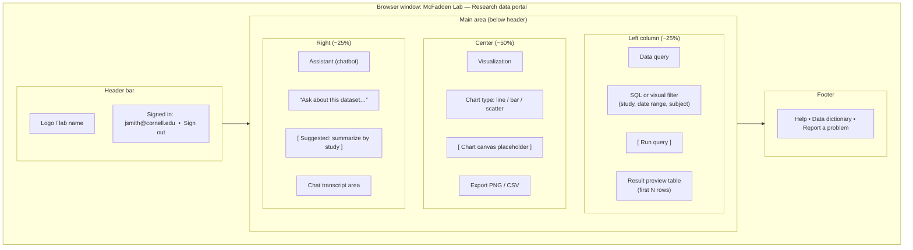

# Analytics portal mockup (query + charts + chatbot + sign-in)

This is a **low-fidelity** sketch of a future lab portal: **sign-in**, **query** cleaned data, **visualize** results, and **chat** with an assistant grounded in your data dictionary and approved queries. Implementation details (hosting, identity provider, LLM policy) are TBD and subject to Cornell IT and data governance.

---

## Screen layout (concept)



---

## ASCII wireframe (makeshift “screenshot”)

```
┌──────────────────────────────────────────────────────────────────────────────────┐
│  McFadden Lab — Data portal          [ ? Help ]    Signed in: you@cornell [Out]   │
├──────────────────────────────────────────────────────────────────────────────────┤
│                                                                                  │
│  ┌─ Query ─────────────────┐  ┌─ Visualization ─────────────────────────────┐  │
│  │ Dataset: Gold / studies │  │  [ Line ▾ ]  [ Add series ]  [ Refresh ]    │  │
│  │ Study ID: [___________]  │  │  ┌─────────────────────────────────────────┐  │  │
│  │ Date: [____] – [____]    │  │  │     📈  (chart renders here)            │  │  │
│  │ [ Run query ]            │  │  │                                         │  │  │
│  │ ┌─────────────────────┐  │  │  └─────────────────────────────────────────┘  │  │
│  │ │ time │ subject │ v │  │  │  [ Export PNG ]  [ Export data ]               │  │
│  │ └─────────────────────┘  │  └──────────────────────────────────────────────┘  │
│  └──────────────────────────┘                                                    │
│                                                                                  │
│  ┌─ Assistant ────────────────────────────────────────────────────────────────┐  │
│  │ You: Summarize average daily intake by treatment for study DEMO-2026-01.     │  │
│  │ Bot: Here are the aggregated means (gold layer, QC passed). Sources: …      │  │
│  │ [ Type a message…                                        ] [ Send ]         │  │
│  └──────────────────────────────────────────────────────────────────────────────┘  │
│                                                                                  │
│  Data dictionary (units, codes) • API docs (Python/R) • Terms of use             │
└──────────────────────────────────────────────────────────────────────────────────┘
```

---

## Behaviors (intent)

| Area | Intent |
|------|--------|
| **Sign-in** | Cornell identity (or approved SSO); **role-based** access to studies or tables. |
| **Query** | Safe access to **Gold** (and optionally Silver) via parameterized queries or curated views—not arbitrary raw Blob access. |
| **Visualization** | Built-in charts for quick exploration; analysts can still use R/Python against the same endpoints. |
| **Chatbot** | Answers grounded in **approved metadata** and **query results**; blocks requests that would leak restricted fields. |

---

## Open `dashboard-mockup.html`

For a clickable static preview in the browser, open **[dashboard-mockup.html](dashboard-mockup.html)** in this folder (double-click or “Open with” a browser). It is **not** connected to real data.
